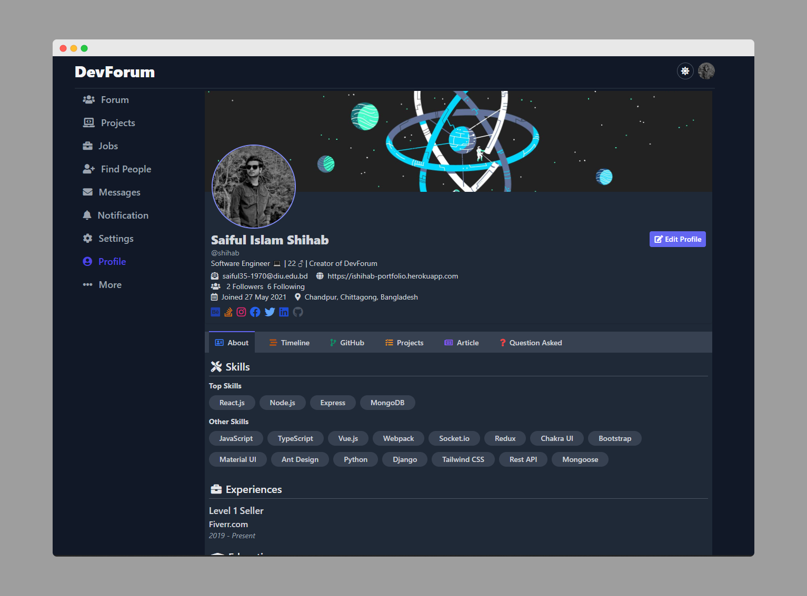

# dev-forum

[DevForum]('https://devforum.netlify.app') an online platform for software developers, build portfolio, bid projects & get hired by recruiters.

# Contributing

Looking for contribution? We love your contribution. Here's how you can help.

- If want to add new feature create an issue first and discuss.
- Reporting a bug.
- Submitting a fix by PR.

# Pull Request

Pull requests are the best way to propose changes to the codebase. We actively welcome your pull requests.

1. Fork the repo and create your branch from `master`.
2. If you've added code that should be tested, add tests.
3. Make sure your code lints.
4. Issue that pull request.
5. Try to attach screenshots of new update or changes when opening a PR.

### Screenshot

Live: https://devforum.netlify.app/h/profile/about

Licensed under the [MIT License](LICENSE.md).
